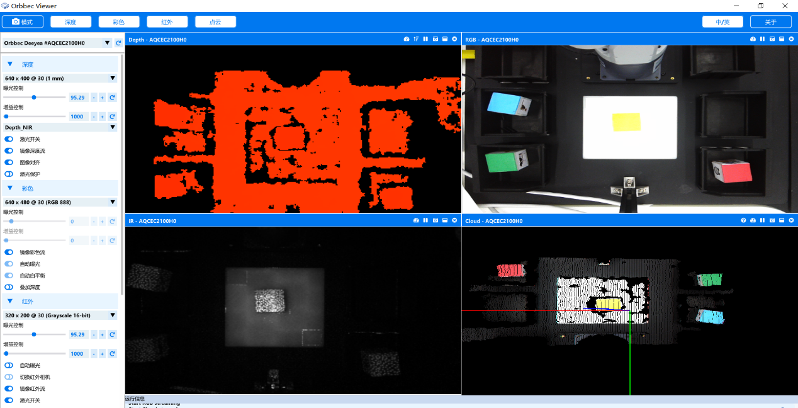
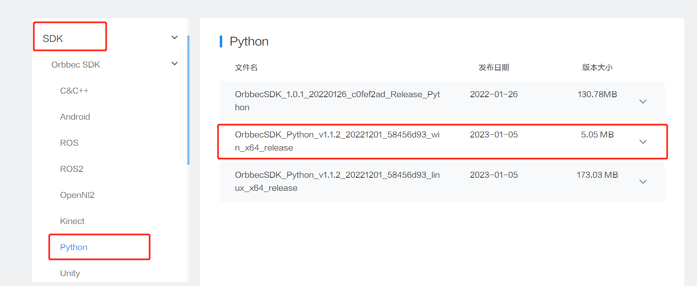
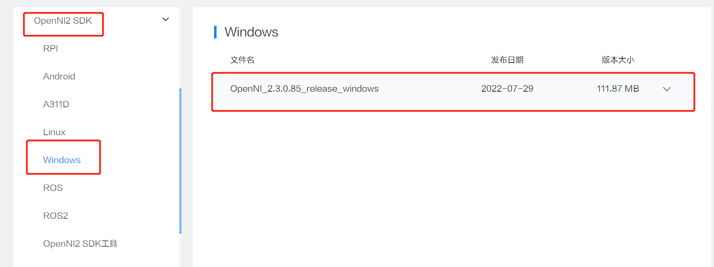
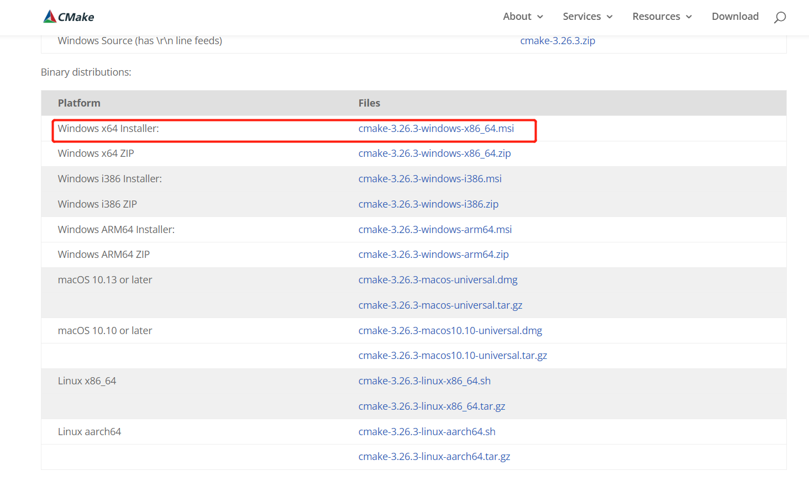
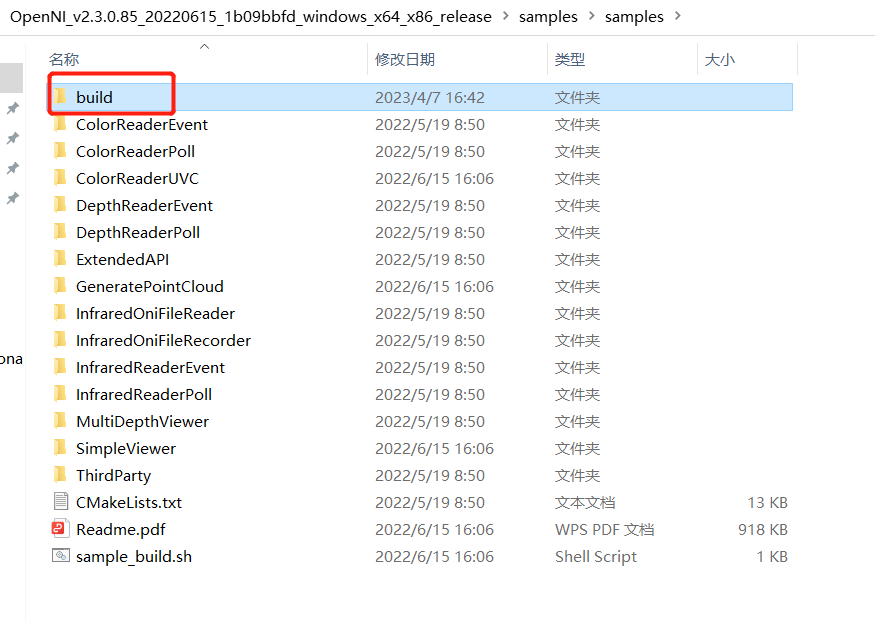
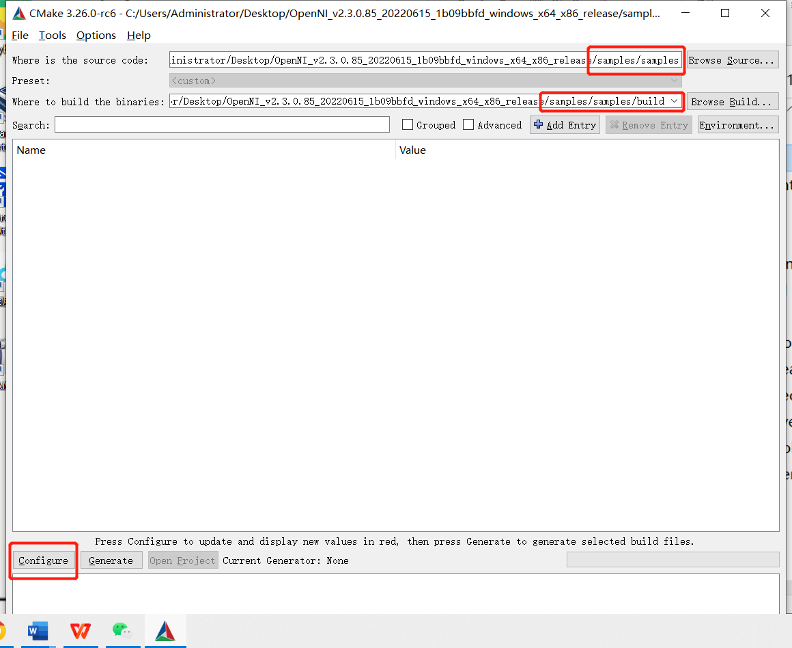
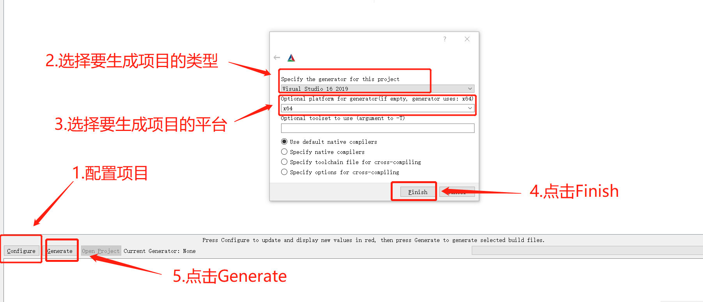
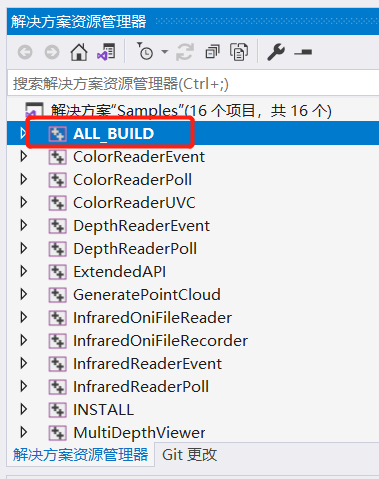
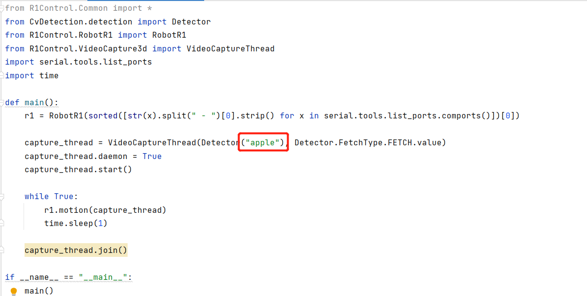

# 奥比中光使用教程

## 一.环境配置

前提：numpy版本1.21.0及以上，opencv-python版本4.6.0.66

#### 1.下载驱动并安装

下载链接：https://developer.orbbec.com.cn/download.html?id=32

#### 2.下载OpenNI2 Viewer

OrbbecViewer for OpenNI2是基于Orbbec OpenNI2 SDK开发的工具，帮助开发者快速使用Orbbec的3D传感器产品。Orbbec OpenNI2 扩展 API 是基于OpenNI2 实现了 Orbbec 3D传感器产品的特性功能，包括读取序列号、获取设备类型、相机参数、控制等功能。

下载链接：https://developer.orbbec.com.cn/download.html?id=250

使用教程：https://developer.orbbec.com.cn/technical_library.html?id=36

OrbbecViewer for OpenNI2演示平台：Windows x64

#### 3.下载Orbbec SDK

下载链接：https://developer.orbbec.com.cn/download.html?id=82

#### 4.下载OpenNI2 SDK

下载链接：https://developer.orbbec.com.cn/download.html?id=65

使用教程：https://developer.orbbec.com.cn/technical_library.html?id=29

#### 5.Samples编译

开发环境：Visual Studio 2019

Cmake环境：安装cmake的目的是为了重新生成下载的sdk中的sample环境，下载链接：https://cmake.org/download/(根据自己对应的版本下载即可)

将下载的OpenNI2 SDK解压到任意目录下，新建一个要重新生成的vs项目目录build。

启动cmake，重新生成项目

点击Generate完成cmake编译。最终会在build目录下看到成功生成的“Samples.sln”文件。

图 2.216 编译

点击“Samples.sln”打开工程，点击“ALL_BUILD”编译所有 Sampls，点击“INSTALL”安装依赖库。

# 二.果子摘取

脚本文件：main.py

修改Detector的识别类型即可实现不同果子的摘取。

