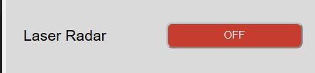
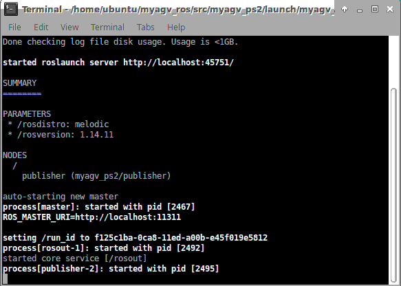
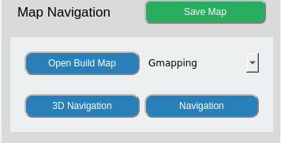
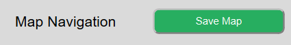
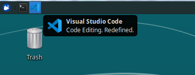
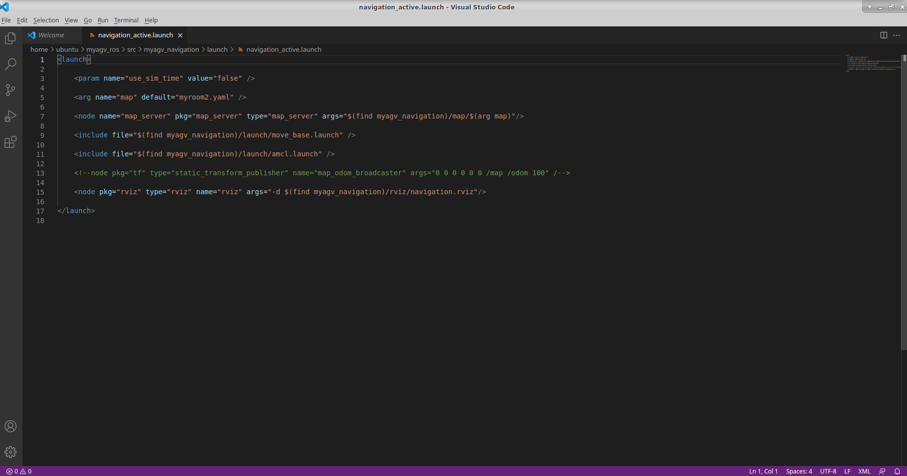
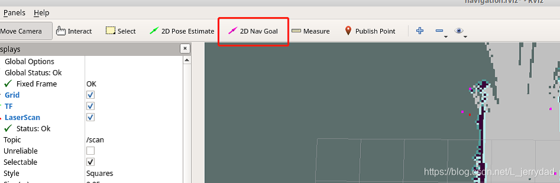
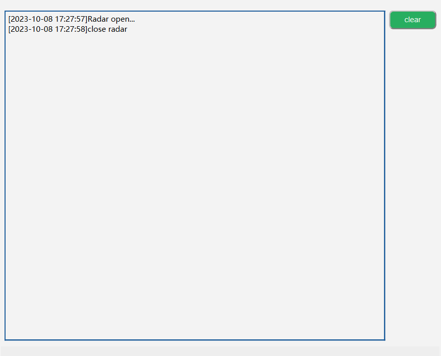
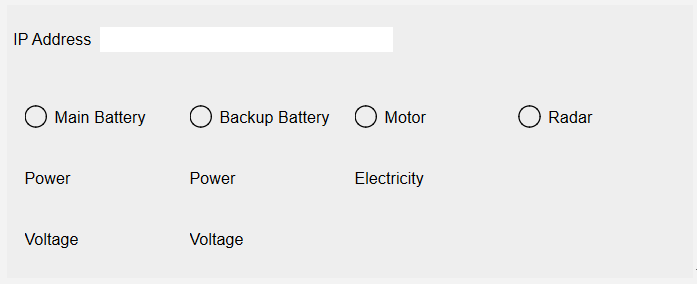

# myAgv software user manual

## 1. Language Switch

Select Chinese and English to switch the corresponding language.

## 2. Laser Radar

1. Click the button to open the radar. The button turns red and the text display "Off".
2. myAgv’s radar starts to rotate.
3. A new terminal appears on the desktop, indicating that the radar is successfully opened.
   

**Limit:**  

   1. Radar On: basic control, mapping, navigation, and map saving functions can be used.
   2. Radar Off:
      1. LED light control and test functions can be used
      2. Before turning off the radar, you need to ensure that the basic control, mapping, and navigation functions have been turned off.

## 3. Basic Control

>There are two ways to control the machine move by keyboard and handle.

**前置条件：** The radar needs to be turned on before turning on the basic control. If it is not turned on, a prompt box will pop up showing "Radar is not turned on".

Click the drop-down box to select the required control method, and click the button on the left to open. At this time, a new terminal will open on the desktop.

### 3.1 Keyboard Control

     

**Directional keys:**

Keystrokes    | Directions
-------- | -----
i  | forward
，  | Backward
j | Move left
l | Move right
u|Rotate counterclockwise
o|clockwise rotation
k|stop

### 3.2 Handle Control

#### 2.1 Handle-Letter type

   

   >There are 7 buttons on the handle to control the car movement, as shown in the picture, 1~4 control the car forward and backward and left and right movement, 5 control the car counterclockwise rotation, 6 control the car clockwise rotation, 7 is the stop button.

   

---

#### 2.2 Handle-Digital type

   

   >There are 7 buttons on the handle to control the car movement, as shown in the picture, 1~4 control the car forward and backward and left and right movement, 5 control the car counterclockwise rotation, 6 control the car clockwise rotation, 7 is the stop button.

   

## 4. Map and Navigation

**Preconditions：**

   1. Open radar
   2. Open keyboard control  

If it is not opened, a prompt box will pop up to prompt for the items that need to be opened.

### 4.1 Build Map

**There are two way for building map by Gmapping and Cartographer.**

#### Gmapping

Click the drop-down box to select the Gmapping mapping method, and click the "Open Mapping" button to start mapping.

   1. Desktop display rviz interface.
   2. Select the opened keyboard terminal and use the keyboard to control the car. The rviz space will build the map as the car moves. The trajectory is shown in the figure:  

#### Cartographer

Click the drop-down box to select the Gmapping mapping method, and click the "Open Mapping" button to start mapping.

   1. Click the button and it will open a new terminal. If the terminal keeps scrolling the output data, the cartographer build file is successfully opened, and the terminal displays the following status：   
   2. When the code runs successfully, rviz will be opened, and the map and lidar information will be displayed in rviz, and the red arrow is the direction of the car. The interface is shown in the figure.   
   3. Select the opened keyboard terminal and use the keyboard to control the car. The rviz space will build the map as the car moves. The trajectory is shown in the figure:  

**Limit:** Navigation cannot be used after mapping is turned on; if you need to use the navigation function, please turn off mapping first.

#### 4.1.1 Save Map

Click the "Save Map" button, and a new terminal will appear on the desktop to display the saved map information, as shown in the figure. The red circled part in the picture is the saved map file:

**The default save path is in the software running directory.**

### 4.2 Navigation

### Preconditions

#### 1. Copy and paste the saved map file into this path

 > /home/ubuntu/myagv_ros/src/myagv_navigation/map/

#### 2.modify the launch file

1. Click to open Visual Studio Code in the top left corner to open the code editor.

2. Open the navigation_active.launch file in /home/ubuntu/myagv_ros/src/myagv_navigation/launch/ path.

3. Replace the myroom2.yaml in line 5 with our own map file name map.yaml.

4. Save the modified file and exit (VScode is more memory intensive when running, it is recommended to close VScode after modifying the code, otherwise the running carsystem will be very laggy, you can also use vim and other lightweight editors.)

**After following the above steps, click the corresponding button according to the desired navigation method.**  
**A Rviz simulation window will open. Note: It is best to place the initial position of the car at the starting position of the car when we build the map.**

### Adjust

If the car on the Rviz interface does not correspond to the actual car, click "2D Pose Estimate" on the top toolbar to adjust, so that the car on the Rviz interface and the realized car can correspond, and navigate after adjustment.

1. Click on "2D Nav Goal" in the top toolbar.

2. Click on the point we want to reach on the map, the carwill start towards the target point, and you can also see in the rviz a planned path of the carbetween the starting point and the target point, the carwill move along the route to the target point.

**Limit:**

1. You can only choose one of the two methods: navigation and 3D navigation. If you need to use another one, please close the current one.
2. Mapping cannot be opened after the navigation is turned on. If you need to build a map, please close the navigation.

## 5. LED light Control

**Preconditions：** Close radar
Use the disc to select the light color, and drag the slider to change the brightness of the light color. The right side of the picture shows the corresponding HEX and RGB values.

## 6. Testing FUnction

**Limit：During the test, the radar, basic control, and map navigation modules cannot be used.**

### 6.1 Motor

**Functions：** Check whether the motor can operate normally  
**Running：**  

1. Select the 'Motor' from the drop-down box and click to start testing
2. In this process, it is recommended to place myAgv on the ground for testing; during the process, it will go forward and backward for 4 seconds each, translate left and right for 4 seconds each, and rotate left and right for 8 seconds each.
3. After all the above steps are executed, the detection is completed.

### 6.2 LED light

**Functions：** Check whether the Led light can operate normally  
**Running：**  

1. Select the 'LED' from the drop-down box and click to start testing
2. Switch the red, orange, yellow, green, blue, and purple colors in sequence. If the color switching can be observed normally, the LED light is used normally.
3. The display time of each color is 1s. After all colors are displayed normally, the detection is completed.

### 6.3 3D Camera

To update.

### 6.4 2D Camera

**Functions：** Check whether the 2D camera can operate normally  
**Running：**  

1. Select the '2D Camera' from the drop-down box and click to start testing
2. A new window pops up to display the image captured by the camera; if the image can be displayed, the camera is operating normally.
3. The screen is displayed for about 5 seconds, and then the window screen is automatically closed. Testing completed.

### 6.5 Pump

**Functions：** Check whether the pump can operate normally  
**Running：**  

1. Select the 'Pump' from the drop-down box and click to start testing
2. The suction pump is turned on and turns off automatically after running for 4 seconds; at this time the detection is completed

## 7. Log Area

All the above operations will be displayed in the log area. Click the "Clear Button" on the right side of the icon to clear the current content.

## 8. Status Detection

**1. IP Address:** Show current IP address  
**2. Battery Information:** Display the currently connected battery information  
（1） When connected, the green light and the corresponding power and voltage are displayed; when not connected, the display is gray and the value is 0.  

**3. Motor Current:** Shows whether there is current flowing through and the electricity value  
（1） When the motor is in motion and there is current flowing through it, the motor will light up green and the page will display the current value; otherwise it will be gray.  

**4. Radar Detection:** Shows whether radar is on  
（1） When the radar button is turned on, the green light turns on; when the radar button is turned off, the light turns off and turns gray.
