[toc]

# User Manual

## 1 Install Python 3.9

> **Notice:** Before installation, check the operation system of PC. Press right button on the `My Computer` icon and then select `Properties`. Install the corresponding Python.
>
> 
>
> 

- **Go to https://www.python.org/downloads/release/python-3910/ to download Python3.9.10**

 **Tick `Add Python 3.9 to PATH`. Click on `Install Now`, and then installation begins.**

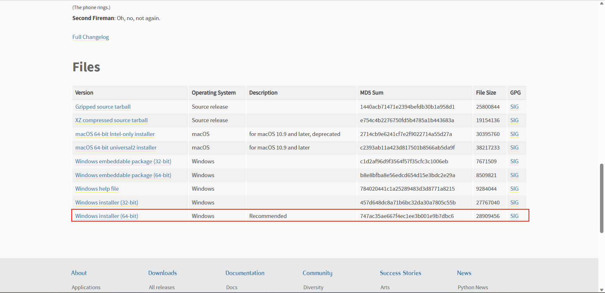


## 2 Installation of PyCharm

PyCharm is a powerful python editor with the nature of cross-platform. Follow the steps below to download and install PyCharm.

Go to **[PyCharm](http://www.jetbrains.com/pycharm/download/#section=windows)** to download PyCharm.

### 2.1 Download and Installation

Official website view:


It is recommended to install the free version.

- Click on `Next`:


- Select options according to your needs and then select `Next`:


- Tap `Install`:


- Installing:


- Tap `Finish`

  

### 2.2 Create a new project

- Click `+New Project` :


- The `Interpreter` is used to interpret python programs. Select `Add Interpreter` ->`New`to add base interpreter.

  

  

- `Location` refers to the place where to save python file. Choose a file to put your programs.

  

- Click on `Create` and a sample appears: 

- Right click on the selection that the red arrow points, and create a new python file.

  

- Type name for the new file.

  

## 3 Camera Environment Setup

### 3.1Driver Installation

Download Links：https://developer.orbbec.com.cn/download.html?id=32


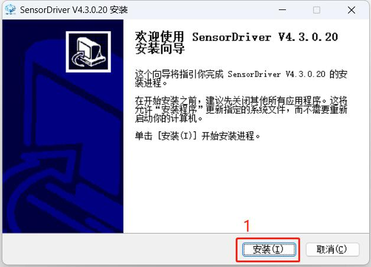


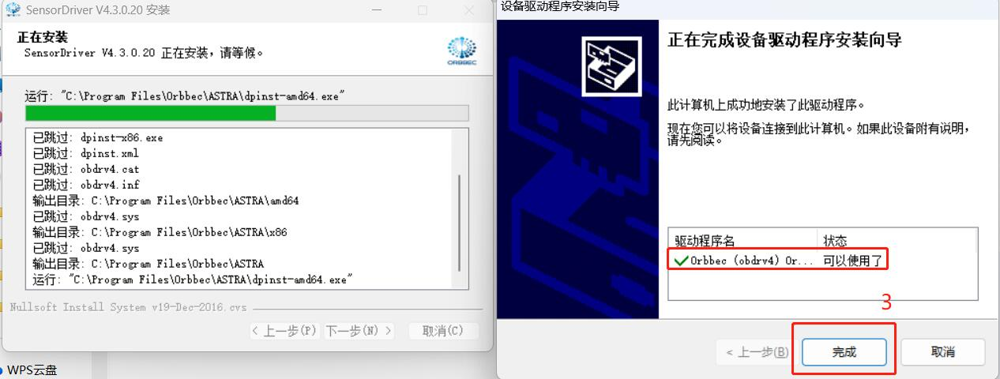


### 3.2 Creating a Virtual Environment in PyCharm

got to the address **https://github.com/elephantrobotics/AGV_UI** to download AGV_UI and put it into PyCharm.


Loading Project Files 

Python Version: 3.9


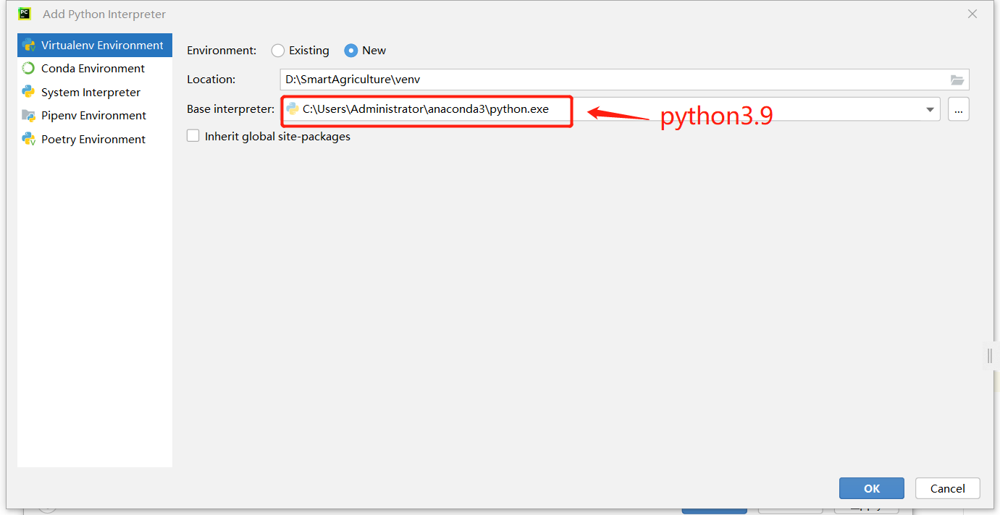

### 3.3 Downloading Required Packages

##### 3.3.1 Enter "pip install -r requirements.txt" in the terminal.

##### 3.3.2 Copy the files from the "Ob_libs" folder to "./venv/Lib/site-packages".

## 4 AGV Startup

### 4.1 Standard Scene Setup


Scene constructed using 4x5 white panels.

Scene length: approximately 220cm.

Scene width: approximately 180cm.

#### Placing Objects

- Square corner made with white panels at the bottom left.
- Inclined surface made with white panels at the top right.

#### Installing Aluminum Profiles

- Aluminum profile for unloading at the bottom right: 10cm from the width, 5cm from the length.
- Aluminum profile for loading at the top left: 10cm from the width, 5cm from the length.

#### Placing Parking Sign and Aruco

- Top left parking sign: 17cm from the width, 25cm from the length. Place the Aruco code where the arrow points in the parking sign image.

  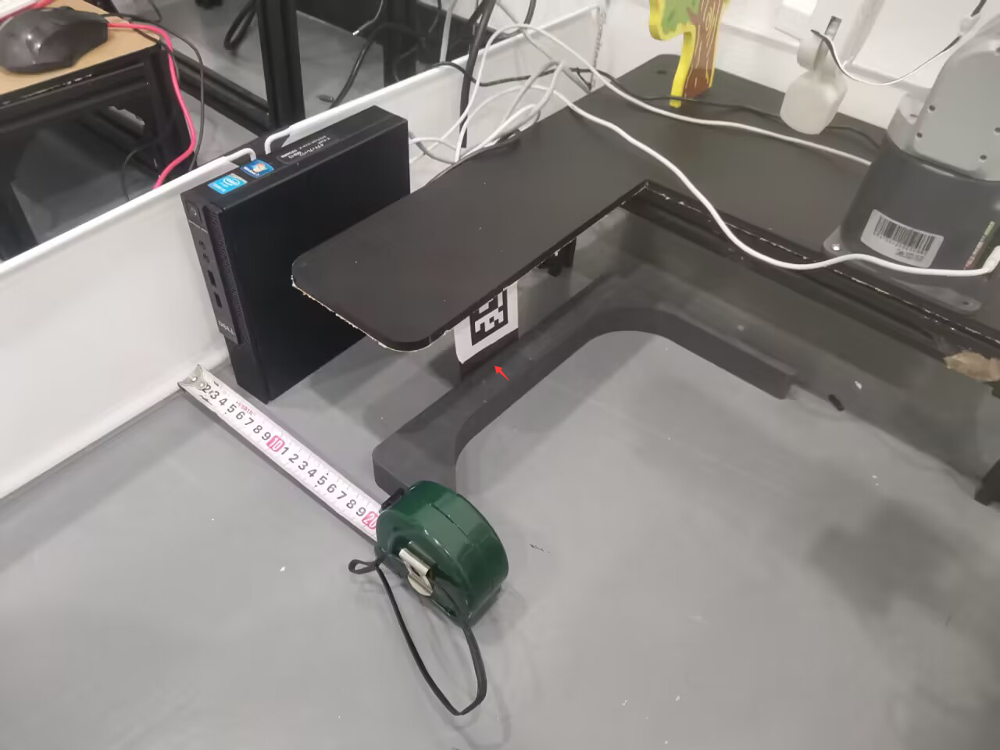

- Aruco code centered at a distance of 18cm from the left side of the aluminum profile, aligning the bottom right arrow of the parking sign with the Aruco center.

  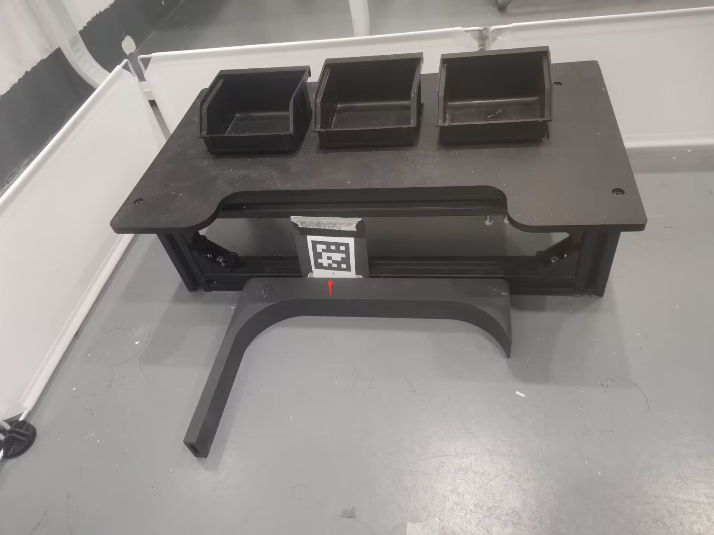
  
-  The direction of the Aruco code


#### Initial Position of the AGV

Using the center of the AGV's camera as reference, 60cm from the length, 40cm from the width.

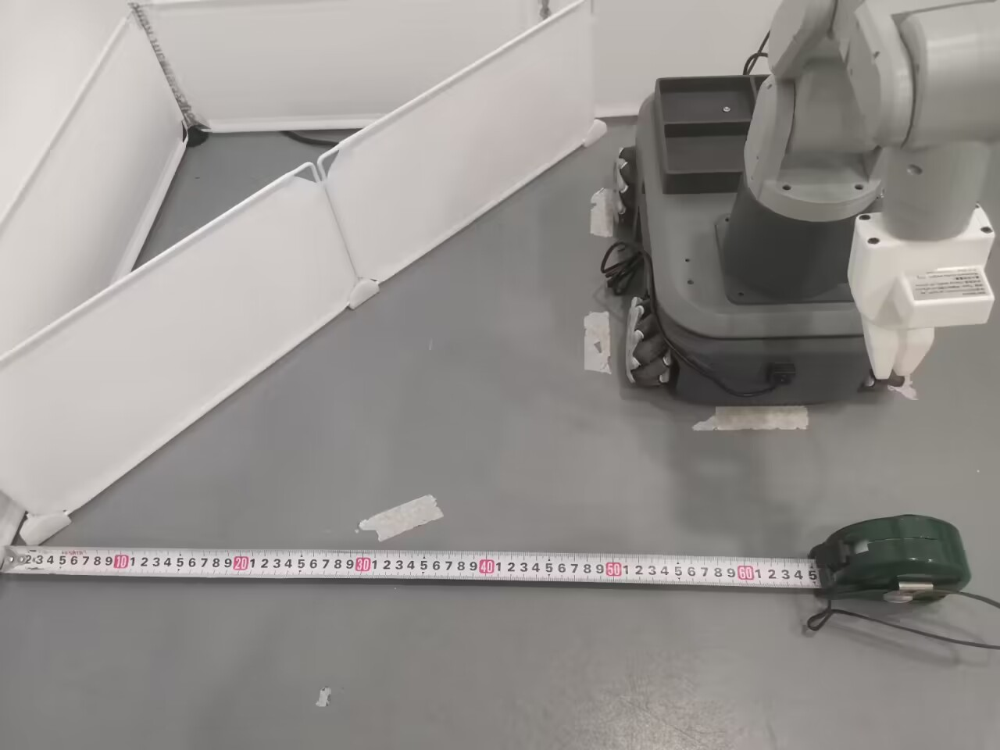

#### Standard Camera Installation

Top of the parking sign aligned with the aluminum profile, height: 20cm.

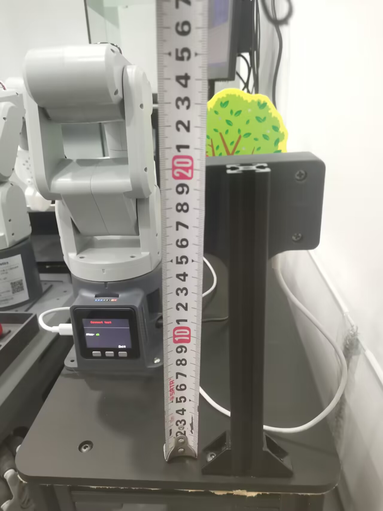

#### Installing Arm at Loading Point

Align the sixth joint to the zero position, install the gripper as shown in the image. 

Install the arm base corresponding to the base screen.


#### Installing Arm on the AGV

Align the sixth joint to the zero position, install the gripper as shown in the image. 

Install the 270-M5 arm base corresponding to the base screen.


### 4.2 Open the SLAM laser scan launch file

After opening the car, open the console terminal (shortcut Ctrl+Alt+T)，and enter the following command in the command line:

```bash
cd myagv_ros
roslaunch myagv_odometry myagv_active.launch
```

***Note: Before opening the launch file, please place the car at a suitable starting point in the environment where you need to build the map, because opening the launch file will open the IMU sensor and odometer of the car, and moving the car artificially will cause distortion of the car build.\***

Open the launch file required for the carriage SLAM laser scan, if it shows

> Now YDLIDAR is scanning ......

Then the car lidar file is opened successfully and the status is displayed in the terminal as follows：


#### 4.2.1Open the gmapping build launch file

Open a new console terminal again and enter the following command at the command line.

```bash
cd myagv_ros
roslaunch myagv_navigation myagv_slam_laser.launch
```

Open the launch file required for the cartographer build. If the terminal keeps scrolling the output data, the cartographer build file is successfully opened, and the terminal displays the following status：

#### 4.2.2Open the keyboard control file

Open a new console terminal and in the terminal command line type.

```bash
cd myagv_ros
roslaunch myagv_teleop myagv_teleop.launch
```


**Directional keys:**

| Keystrokes | Directions              |
| ---------- | ----------------------- |
| i          | forward                 |
| ，         | Backward                |
| j          | Move left               |
| l          | Move right              |
| u          | Rotate counterclockwise |
| o          | clockwise rotation      |
| k          | stop                    |

#### 4.2.3Start building a map

Now the car can start to move under the control of the keyboard, control the car around the space where you want to build the map. At the same time, you can see our map in the Rviz space will follow the car's movement and build the map a little bit. ***Note: When using the keyboard to operate the car, make sure that the terminal running the myagv_teleop.launch file is the currently selected window, otherwise the keyboard control program will not recognize the keyboard keys.\***


#### 4.2.4Save the constructed map

Open another new console terminal and enter the following command on the command line to save the completed map from the car scan.

```c
rosrun map_server map_saver
```

After running successfully the terminal displays the following：


Here you can see that we have drawn a red circle for the two files generated after saving the map, map.pgm and map.yaml, which will be saved in the home directory by default. Typing **cd** in the same terminal will bring us to our home directory, and then typing **ls** will bring us to our home directory where the generated map files have been created.


### 4.3Starting the AGV Program

**Before starting, ensure that all other terminals are closed, and place the car at the starting position shown in section 4.2. Then run the following file**  

run the script: main_AGV.py
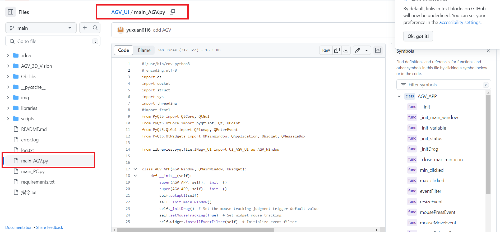

The softeware's interface as follows:
  

Fill in the port number, click Connect, and start the server. At this time, wait for the PC to connect.  

Current AGV side UI interface functions: point acquisition and point saving.

#### Obtain Points

- Clicke the corresponding button. The rviz interface appears.
 

- Use "2D pose estimate" in this interface to click on the corresponding position.
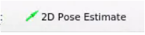  

- The relevant point information will be displayed on the interface.


```
Map Navigation Points:
target point1[(x,y,z,w)] 
target point2[(x,y,z,w)] 
```


Click the Save button to customize the specified save location. After clicking Save, the points displayed on the interface will be saved in the directory of the current program.

  

### 4.4 Explanation of agv_socket_server.py Code Parameters

```python
class MapNavigation:
    def __init__(self):
        self.goalReached = False
        rospy.init_node('map_navigation', anonymous=False)
    
    # init robot feed pose
    def set_pose(self):
        pose = PoseWithCovarianceStamped()
        pose.header.seq = 0
        pose.header.stamp.secs = 0
        pose.header.stamp.nsecs = 0
        pose.header.frame_id = 'map'
        pose.pose.pose.position.x =1.71792924404
        pose.pose.pose.position.y =-0.140987336636
        pose.pose.pose.position.z = 0.0
        q = quaternion_from_euler(0, 0, 1.57)  
        pose.pose.pose.orientation.x = 0.0
        pose.pose.pose.orientation.y = 0.0
        pose.pose.pose.orientation.z =  -0.00343827016283
        pose.pose.pose.orientation.w = 0.999994089132
        pose.pose.covariance = [0.25, 0.0, 0.0, 0.0, 0.0, 0.0, 0.0, 0.25, 0.0, 0.0, 0.0, 0.0, 0.0, 0.0, 
         0.0,0.0, 0.0, 0.0, 0.0, 0.0, 0.0, 0.0, 0.0, 0.0, 0.0, 0.0, 0.0, 0.0, 0.0, 0.0, 0.0, 
         0.0,0.0, 0.0, 0.0, 0.06853892326654787]
        rospy.sleep(1)
        pub_setpose.publish(pose)
        rospy.loginfo('Published robot pose: %s' % pose)

    # init robot unload pose
    def set_pose_1(self):
        pose = PoseWithCovarianceStamped()
        pose.header.seq = 0
        pose.header.stamp.secs = 0
        pose.header.stamp.nsecs = 0
        pose.header.frame_id = 'map'
        pose.pose.pose.position.x =-0.0404354333878
        pose.pose.pose.position.y =0.740925848484
        pose.pose.pose.position.z = 0.0
        q = quaternion_from_euler(0, 0, 1.57)  
        pose.pose.pose.orientation.x = 0.0
        pose.pose.pose.orientation.y = 0.0
        pose.pose.pose.orientation.z = 0.723517589404
        pose.pose.pose.orientation.w = 0.690305945088
        pose.pose.covariance = [0.25, 0.0, 0.0, 0.0, 0.0, 0.0, 0.0, 0.25, 0.0, 0.0, 0.0, 0.0, 0.0, 0.0,
         0.0, 0.0, 0.0, 0.0, 0.0, 0.0, 0.0, 0.0, 0.0, 0.0, 0.0, 0.0, 0.0, 0.0, 0.0, 0.0,
         0.0, 0.0, 0.0, 0.0, 0.0,  0.06853892326654787]
        rospy.sleep(1)
        pub_setpose.publish(pose)
        rospy.loginfo('Published robot pose: %s' % pose)

if __name__ == '__main__':
   
    goal_1 = [(1.16042029858 ,0.00591796636581 , -0.278485995788 ,0.960440289737)]
    goal_2 = [(0.0600947737694 ,   0.168367922306 , 0.803892890157,0.594774092538)]

    map_navigation = MapNavigation()
```

This script defines goal positions for navigation. The set_pose and set_pose_1 functions are used to set the initial poses of the AGV at the feed and unload points, respectively.
> - Feed Point Navigation Position


> - Unload Point Navigation Position

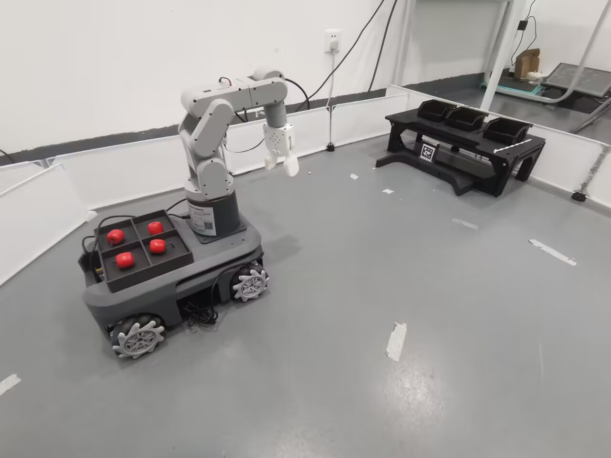


> - Refreshing AGV Pose at Unload Point

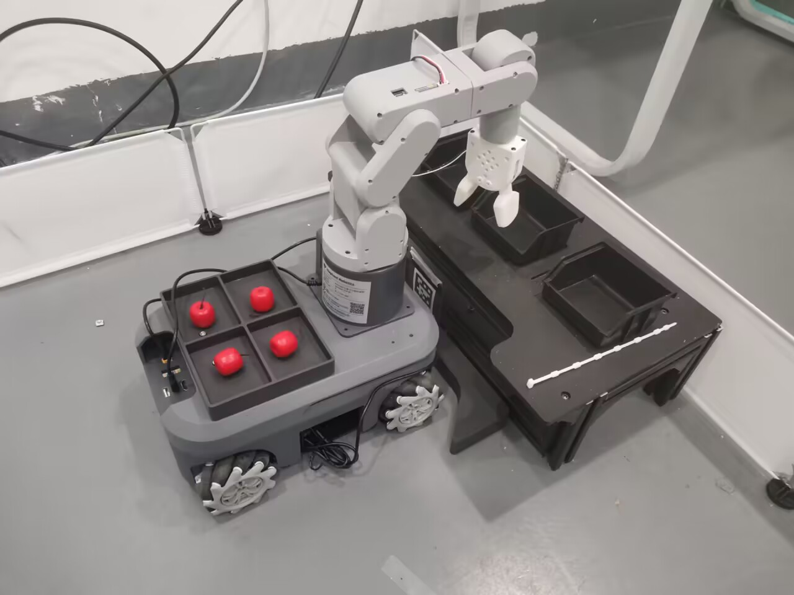

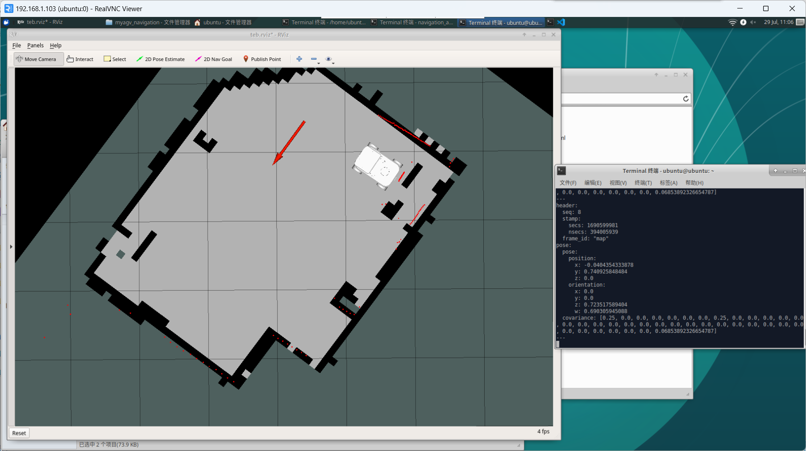

> - Refreshing AGV Pose at Feed Point


## 5 Fruit Picking
Run the script file: main.py


In the UI interface, input the IP address and port obtained from step 4.2, and click on "Connect."

> Explanation of UI features:
>
> - **Feed Area Camera**，Opens the feed area camera and displays it on the interface.
>
> - **AGV Control**，The "Start" button sends a looping command for the AGV to move back and forth between the feed and unload points. The "Pause" button sends a stop command to the AGV (setting its speed to 0). Clicking the "Resume" button sends the AGV's speed back to the previous level.
>
> - Point Control:This section divides AGV control into four steps.
>
> > **Feed Area**：Navigates the AGV to the feed area point and starts Aruco code navigation.
> >
> > **Feed Complete:**：This button becomes clickable only when the feed area robot arm completes grabbing fruits. Clicking it sends commands for the AGV to move back and left to prevent collisions with the feed area aluminum profile.
> >
> > **Unload Area**：Navigates the AGV to the unload area point and starts Aruco code navigation.
> >
> > **Unload Complete**：This button becomes clickable only when the unload area robot arm completes grabbing fruits. Clicking it sends commands for the AGV to move back and right to prevent collisions with the unload area aluminum profile.

