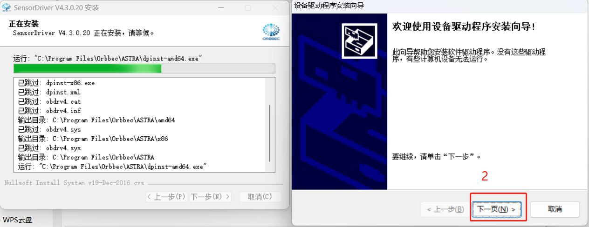
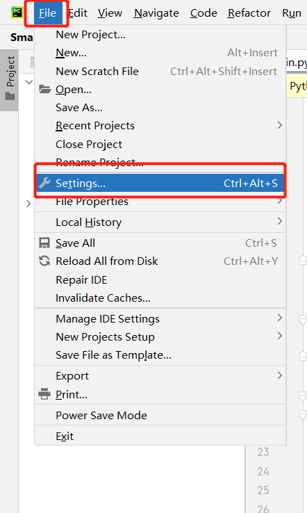
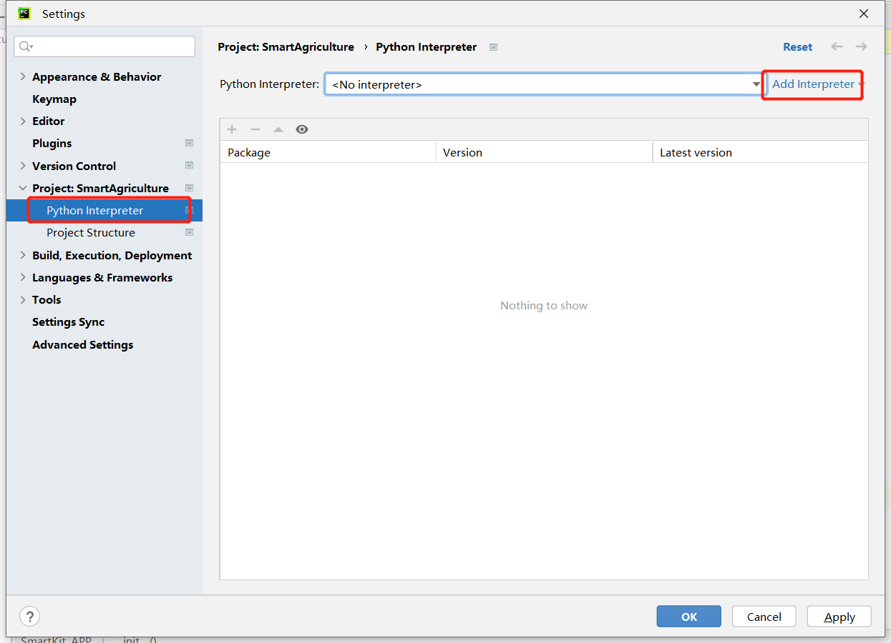

[toc]
# 使用手册

## 1 安装python3.9

注意：安装之前，请先确认您的电脑是64位还是32位。右键点击我的电脑，选择属性。如下图显示是64位的操作系统，所以选择64位的Python安装包。


下载python3.9.10版本

**下载地址**：https://www.python.org/downloads/release/python-3910/

下载对应电脑系统类型，这里选择64位的Python安装包，记得在安装过程中勾选Add Python 3.9 to PATH，其他选项可默认安装。


## 2 PyCharm安装和使用

PyCharm是一款功能强大的Python编辑器，具有跨平台性。首先介绍PyCharm在Windows系统中的安装步骤。

**下载地址：** **https://www.jetbrains.com/pycharm/download/#section=windows**

### 2.1 下载安装

- 进入该网站后，我们会看到如下界面：


根据界面介绍下载文件，Professional表示专业版，Community是社区版，推荐安装社区版，因为是免费使用的。

- 下载好之后开始安装，点击`Next`：


- 按照个人喜好选择相应选项，然后点击`Next`：


- 出现下图界面继续点击`Next`：


- 点击`Finish`结束安装：


### 2.2 创建项目测试

PyCharm安装完成之后进入该软件，创建第一个程序。

- 单击桌面上的PyCharm图标，进入到PyCharm中，如下图所示，点击`New Project`：


- 点击之后找到`Interpreter`，开始对解释器进行设置，点击`Add Interpreter`：


- 点击`New`，找到python.exe存储位置，勾选`Inherit global site-package`选项：


- 设置`Location`。Location是存储PyCharm项目的地方，可根据需要自行选择。


- 新建PyCharm文件。右击箭头指向的文档图标，点击`New`，点击`Python File`，新建成功。


- 命名Python File：


- 文件创建成功后便进入如下的界面，便可以编写自己的程序了


## 3 相机环境搭建

### 3.1安装驱动

下载链接：https://developer.orbbec.com.cn/download.html?id=32





### 3.2pycharm创建虚拟环境

在github网站上拉取代码https://github.com/elephantrobotics/AGV_UI并加载到pycharm工程文件中


加载工程文件

python版本：3.9






### 3.3相关包下载

##### 3.3.1终端输入pip install -r requirements.txt

##### 3.3.2将Ob_libs中的文件复制至./venv/Lib/site-packages中

## 4.AGV启动

### 4.1场景搭建标准


使用4*5白色挡板构建场地

场地长：约220cm

场地宽：约180cm


#### 放置特征物体

左下角使用白色挡板建立方形拐角

右上角使用白色挡板建立倾斜面


#### 放置铝型材：

右下角下料点铝型材：距离宽10cm，距离长5cm

左上角上料点铝型材：距离宽10cm，距离长5cm


#### 放置停车打印件和二维码

左上角打印件：距离宽17cm，距离长25cm。二维码放置在打印件箭头处


二维码中心位置放置距离铝型材左侧：18cm，右下角打印件箭头对齐二维码中心点。


二维码的方向


#### 小车起始位置

以小车摄像头中心为准，距离长：60cm，距离宽：40cm


#### 摄像头安装位置标准

打印件顶部对齐铝型材，高度:20cm，打印件顶部对齐铝型材


#### 上料点机械臂安装标准

将第六关节对准零位，将夹爪对应下图安装。

机械臂底座屏幕对应下图安装。


#### AGV机械臂安装标准

将第六关节对准零位，将夹爪对应下图安装。

270-M5机械臂底座屏幕对应下图安装。


### 4.2 myAGV-gmapping实时建图建图

打开小车后，打开控制台终端(快捷键Ctrl+Alt+T)，在命令行中输入以下指令:

```bash
cd myagv_ros
roslaunch myagv_odometry myagv_active.launch
```

***注意：在开启launch文件之前，请先将小车放置在需要建图环境中的一个合适起始点位上，因为开启launch文件将会开启小车的IMU传感器及odom里程计，人为的移动小车将造成小车建图失真。\***

打开小车slam激光扫描所需的launch文件，若显示

> Now YDLIDAR is scanning ......

则说明小车雷达文件打开成功，终端内显示状态如下：


#### 4.2.1打开gmapping建图launch文件

重新打开一个控制台终端，在命令行中输入以下指令：

```bash
cd myagv_ros
roslaunch myagv_navigation myagv_slam_laser.launch
```

#### 4.2.2打开键盘控制文件

重新打开一个控制台终端，在终端命令行中输入：

```bash
cd myagv_ros
roslaunch myagv_teleop myagv_teleop.launch
```


**方向键：**

| 按键 | 方向       |
| ---- | ---------- |
| i    | 前进       |
| ，   | 后退       |
| j    | 向左运动   |
| l    | 向右运动   |
| u    | 逆时针旋转 |
| o    | 顺时针旋转 |
| k    | 停止       |

#### 4.2.3开始建图

现在小车可以在键盘的控制下开始移动了，操控小车在所需建图的空间内转一圈吧。与此同时，可以看到在Rviz空间里我们的地图也会跟着小车的移动一点点的把地图构建出来了。 ***注意：在用键盘操作小车的时候，确保运行myagv_teleop.launch文件的终端是当前选中的窗口，否则键盘控制程序无法识别键盘的按键。\*** 

#### 4.2.4保存所构建的地图

再打开一个新的控制台终端，在命令行中输入以下指令，用来保存小车扫描完成的地图：

```c
rosrun map_server map_saver
```

运行成功后终端显示如下：


这里可以看到我们画了个红圈圈，只是地图保存后生成的两个文件，分别为 map.pgm 和 map.yaml。这两个文件默认会保存在家目录。在同一个终端内输入 **cd** 则会进入我们的家目录，再输入 **ls** 可以看到在家目录下生成的地图文件已经生成好了。


### 4.3 AGV程序启动

**在启动前确保其他终端都关闭，并把小车移动到4.2所示的小车起始位置。然后运行对应脚本文件。**

运行脚本文件： main_AGV.py  


软件界面如图示：  


填入端口号，点击连接，开启服务端。此时等待PC端连接。

目前AGV端UI界面功能：点位获取和保存点位

#### 点位获取

- 点击该按钮，出现rviz界面。  
  

- 使用该界面中的“2D pose estimate” 点击对应位置.
  

- 相关的点位信息显示在界面上。
  


```
目标点位1[(x,y,z,w)]是上料导航点位
目标点位2[(x,y,z,w)]是下料导航点位
```


#### 保存点位
点击保存按钮, 可自定义指定保存的位置，点击保存后，会将界面上显示的点位保存在当前程序的目录下。  
  


### 4.4 agv_socket_server.py代码参数分析

```python
class MapNavigation:
    def __init__(self):
        self.goalReached = False
        rospy.init_node('map_navigation', anonymous=False)
    
    # init robot feed pose
    def set_pose(self):
        pose = PoseWithCovarianceStamped()
        pose.header.seq = 0
        pose.header.stamp.secs = 0
        pose.header.stamp.nsecs = 0
        pose.header.frame_id = 'map'
        pose.pose.pose.position.x =1.71792924404
        pose.pose.pose.position.y =-0.140987336636
        pose.pose.pose.position.z = 0.0
        q = quaternion_from_euler(0, 0, 1.57)  
        pose.pose.pose.orientation.x = 0.0
        pose.pose.pose.orientation.y = 0.0
        pose.pose.pose.orientation.z =  -0.00343827016283
        pose.pose.pose.orientation.w = 0.999994089132
        pose.pose.covariance = [0.25, 0.0, 0.0, 0.0, 0.0, 0.0, 0.0, 0.25, 0.0, 0.0, 0.0, 0.0, 0.0, 0.0, 
         0.0,0.0, 0.0, 0.0, 0.0, 0.0, 0.0, 0.0, 0.0, 0.0, 0.0, 0.0, 0.0, 0.0, 0.0, 0.0, 0.0, 
         0.0,0.0, 0.0, 0.0, 0.06853892326654787]
        rospy.sleep(1)
        pub_setpose.publish(pose)
        rospy.loginfo('Published robot pose: %s' % pose)

    # init robot unload pose
    def set_pose_1(self):
        pose = PoseWithCovarianceStamped()
        pose.header.seq = 0
        pose.header.stamp.secs = 0
        pose.header.stamp.nsecs = 0
        pose.header.frame_id = 'map'
        pose.pose.pose.position.x =-0.0404354333878
        pose.pose.pose.position.y =0.740925848484
        pose.pose.pose.position.z = 0.0
        q = quaternion_from_euler(0, 0, 1.57)  
        pose.pose.pose.orientation.x = 0.0
        pose.pose.pose.orientation.y = 0.0
        pose.pose.pose.orientation.z = 0.723517589404
        pose.pose.pose.orientation.w = 0.690305945088
        pose.pose.covariance = [0.25, 0.0, 0.0, 0.0, 0.0, 0.0, 0.0, 0.25, 0.0, 0.0, 0.0, 0.0, 0.0, 0.0,
         0.0, 0.0, 0.0, 0.0, 0.0, 0.0, 0.0, 0.0, 0.0, 0.0, 0.0, 0.0, 0.0, 0.0, 0.0, 0.0,
         0.0, 0.0, 0.0, 0.0, 0.0,  0.06853892326654787]
        rospy.sleep(1)
        pub_setpose.publish(pose)
        rospy.loginfo('Published robot pose: %s' % pose)

if __name__ == '__main__':
   
    goal_1 = [(1.16042029858 ,0.00591796636581 , -0.278485995788 ,0.960440289737)]
    goal_2 = [(0.0600947737694 ,   0.168367922306 , 0.803892890157,0.594774092538)]

    map_navigation = MapNavigation()
```

```
goal_1[(x,y,z,w)]是上料导航点位
goal_2[(x,y,z,w)]是下料导航点位

set_pose函数是在上料点重新设置小车位姿
set_pose函数是在下料点重新设置小车位姿
```

> - 上料导航点位


> - 下料区导航点位


> - 下料区刷新自身位姿


> - 上料区刷新自身位姿


## 5.果子摘取

运行脚本文件：main_PC.py


在UI界面输入4.2得到的IP地址和端口，点击连接


> 目前UI界面功能介绍
>
> - **上料区摄像头**，负责打开上料区摄像头并在界面上展示
>
> - **AGV控制**，点击开始是发送一条循环指令让AGV小车来回跑上下料点，暂停是发送一条停止的指令，AGV小车的速度被设置为0，只有再次点击恢复按钮才能发送AGV小车速度
>
> - 定点控制， 分别有四个按钮，相当于把AGV控制的功能拆分成了四个步骤
>
> > **上料区**：对应AGV导航到定点位置1然后开始二维码导航
> >
> > **上料完成**：当上料区机械臂抓取完水果，才能点击上料完成，小车会下发后退和向左运动的指令，防止碰撞上料区铝型材
> >
> > **下料区**：对应AGV导航到定点位置2然后开始二维码导航
> >
> > **下料完成**：当下料区机械臂抓取完水果，才能点击下料完成，小车会下发后退和向右运动的指令，防止碰撞下料区铝型材


