# myAgv 上位机软件使用手册

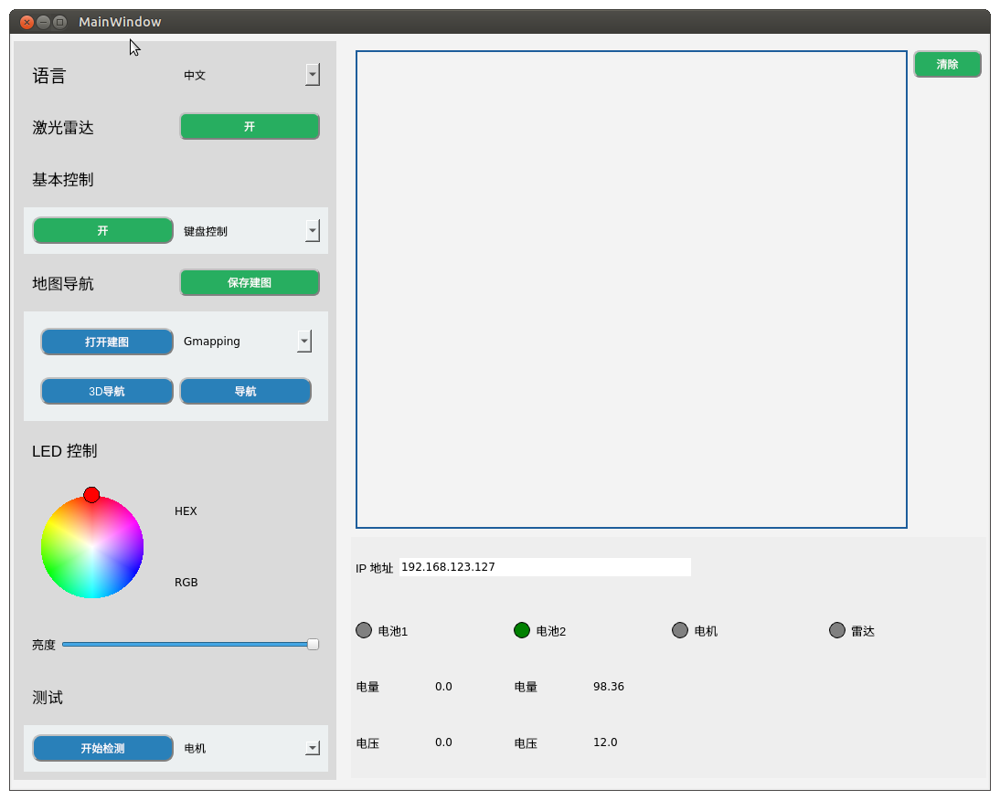

## 1. 语言切换

选择中英文，进行对应的语言切换。

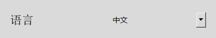

## 2. 雷达功能

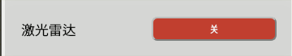

1. 点击按钮，打开雷达。按钮变成红色，文字显示为“关”。
2. myAgv的雷达开始转动。
3. 桌面出现新的终端如图示，说明雷达打开成功。
   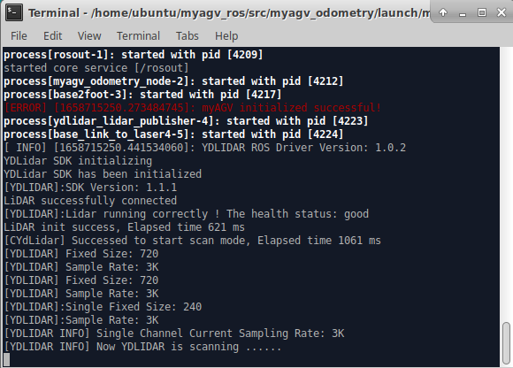

**限制:**  

   1. 雷达打开：可使用基本控制、建图、导航、保存地图功能
   2. 雷达关闭：
      1. 可使用LED灯光控制和测试功能
      2. 雷达关闭前需要确保基本控制、建图、导航功能已经关闭

## 3. 基本控制功能  

>主要通过键盘、手柄两种方式控制机器移动

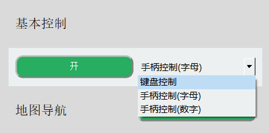

**前置条件：** 打开基本控制前需打开雷达，未打开则弹出提示框显示“雷达未打开”。

点击下拉框选择所需要的控制方式，并点击左侧按钮打开，此时桌面会打开新的终端。

### 3.1 键盘控制

   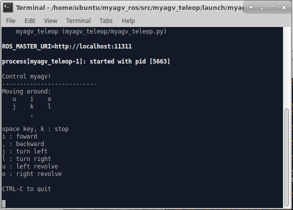  

   **方向键：**

   按键    | 方向
   -------- | -----
   i  | 前进
   ，  | 后退
   j | 向左运动
   l | 向右运动
   u|逆时针旋转
   o|顺时针旋转
   k|停止

### 3.2 手柄控制（选择对应的字母和数字型号）

#### 2.1 手柄-字母款

   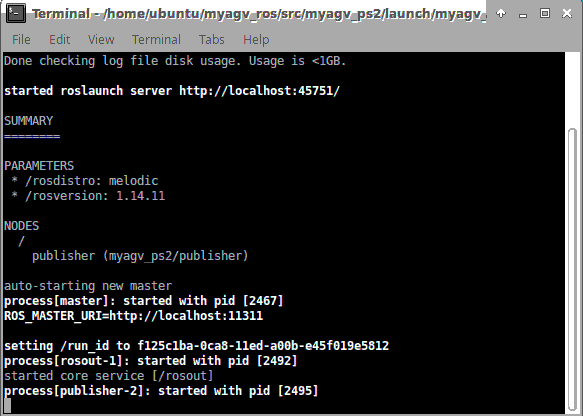

   >如图所示，1~4控制小车前进后退和左右运动，5控制小车逆时针旋转，6控制小车顺时针旋转，7为停止按钮。

   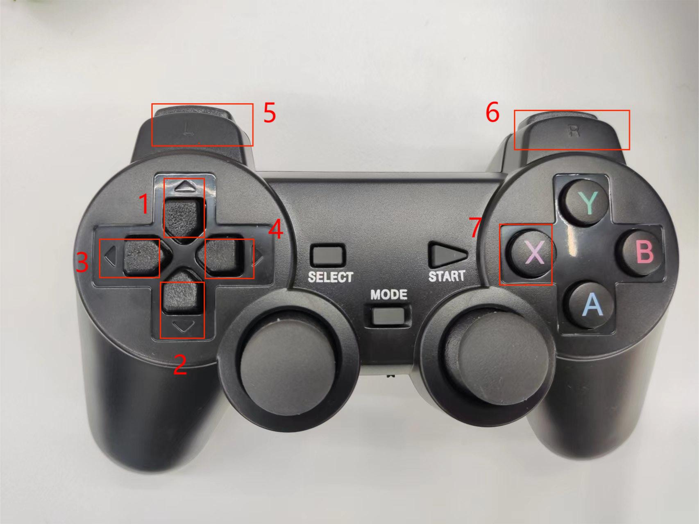

---

#### 2.2 手柄-数字款

   

   >如图所示，1~4控制小车前进后退和左右运动，5控制小车逆时针旋转，6控制小车顺时针旋转，7为停止按钮。

   

## 4. 地图导航

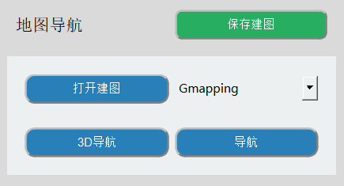

**前置条件：**

   1. 打开雷达
   2. 打开键盘控制  

若未打开，则弹出提示框提示需要打开的项目。

### 4.1 建图

**建图方式分为Gmapping 和Cartographer 两种。**

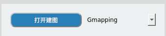

#### Gmapping

点击下拉框选择Gmapping建图方式，点击“打开建图”按钮开始建图。

   1. 桌面显示rviz界面
   2. 选中已打开的键盘终端，使用键盘控制小车，rviz空间会随着小车的移动将地图构建出来。轨迹如图所示：  

#### Cartographer

点击下拉框选择Gmapping建图方式，点击“打开建图”按钮开始建图。

   1. 桌面打开新终端，若终端内不断滚动输出数据，则表示小车cartographer建图文件成功打开，终端内显示状态如下：   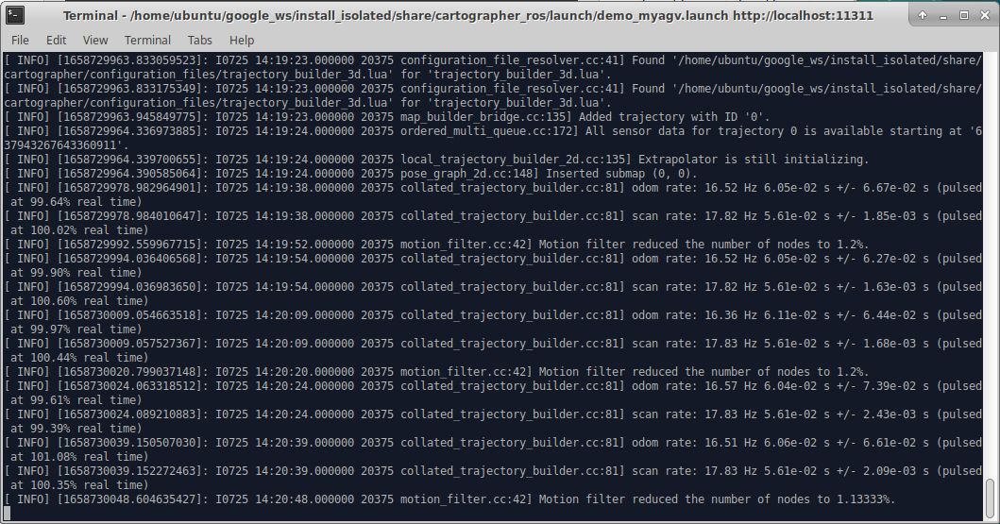
   2. 代码运行成功后会打开rviz，这时在rviz中便会显示地图和雷达信息，红色箭头为小车的朝向。界面如图所示。   
   3. 选中已打开的键盘终端，使用键盘控制小车，rviz空间会随着小车的移动将地图构建出来。轨迹如图所示：  

**限制:** 开启建图后导航不可使用；若需使用导航功能请先关闭建图。

#### 4.1.1 保存建图

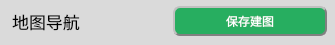

点击“保存建图”按钮，桌面出现新的终端显示保存的地图信息,如图所示。图中红色圈出部分为保存的地图文件：

**默认保存路径在软件运行目录下**

### 4.2 导航

### 前置操作

#### 1. 将保存的地图文件复制粘贴到该路径下

 > /home/ubuntu/myagv_ros/src/myagv_navigation/map/

#### 2.修改launch文件

1. 双击打开左上角的Visual Studio Code 打开代码编辑器，

2. 打开/home/ubuntu/myagv_ros/src/myagv_navigation/launch/路径下的 navigation_active.launch文件
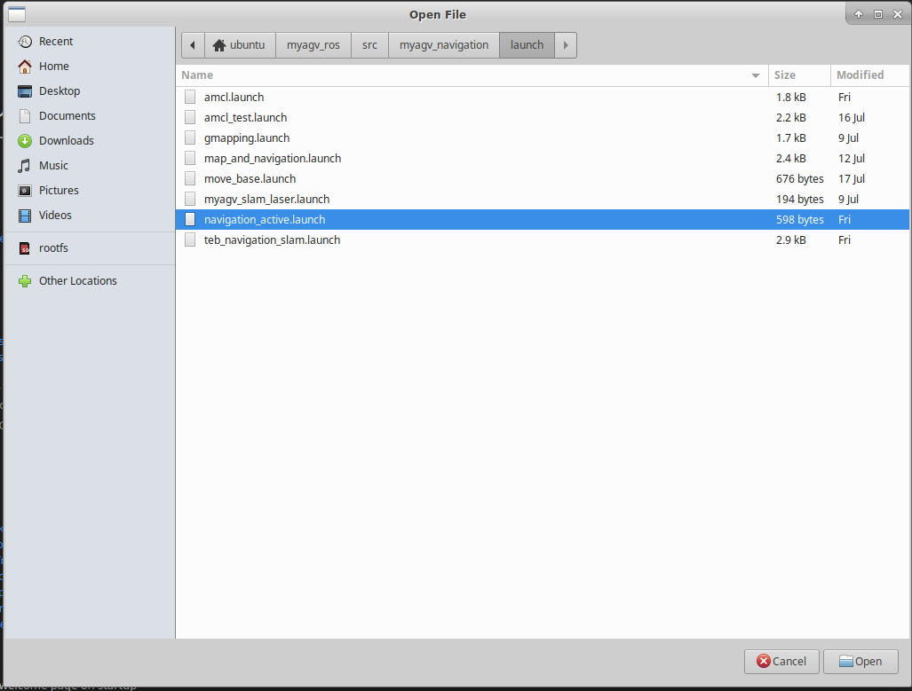

3. 将第5行的 myroom2.yaml 替换成我们自己建图的文件名 map.yaml

4. 保存修改文件并退出(VScode在运行的时候比较占内存，推荐修改完代码后关闭VScode，不然运行小车系统会非常卡顿，也可以使用vim等轻量化编辑器)

**遵循以上步骤后，再根据所需要的导航方式点击对应的按钮进行操作。**  
**此时会开启一个Rviz仿真窗口。注意：小车的初始位置最好放置到我们建图时小车的出发位置**

### 调整

若Rviz界面的小车和实际小车对应不上，点击顶部工具栏的“2D Pose Estimate” 进行调整，使得Rviz界面的小车和实现的小车可对应上，调整后进行导航。

1. 点击顶部工具栏的“2D Nav Goal”

2. 点击地图上我们想要到达的点位，小车便会向着目标点位出发，同时还可以在rviz中看到起点到目标点位间有一条小车的规划路径，小车会沿着路线运动到目标点位。
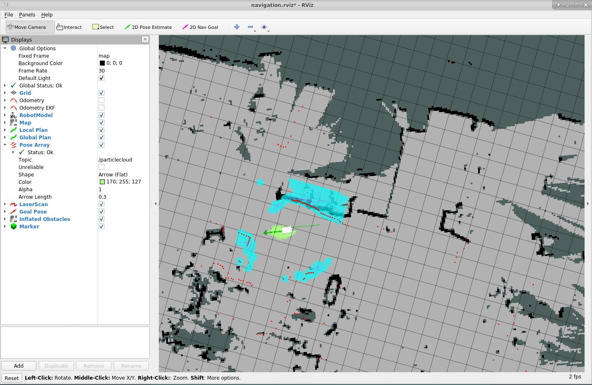

**限制:**

1. 导航和3D导航两种方式只可选择其一。若需使用另一种，请关闭当前的使用方式。
2. 导航打开后不可打开建图，若需建图请关闭导航。

## 5. LED 灯光设置

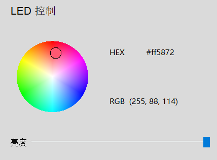

**前置条件：** 关闭雷达
通过圆盘选择灯光颜色，拖动滑动条改变灯光颜色的亮度。图示右侧则显示对应的HEX和RGB值。

## 6. 测试功能

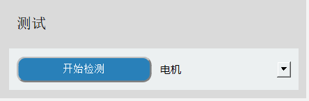
**限制：测试过程中 雷达、基本控制、地图导航 模块不可使用**

### 6.1 电机检测

**功能：** 检测电机是否可以正常运行  
**运行：**  

1. 下拉框选择电机，点击开始测试
2. 该过程建议将myAgv放在地面进行测试；过程中前进后退各4s，左平移和右平移各4s，左旋转和右旋转各8s
3. 以上步骤均执行后，检测完毕

### 6.2 LED灯光检测

**功能：** 检测myAgv的LED灯光是否可以正常使用  
**运行：**  

1. 下拉框选择LED灯，点击开始测试
2. 依次切换赤橙黄绿青蓝紫颜色，若可正常观察到颜色切换；则LED灯正常使用
3. 每个颜色显示时长为1s，所有颜色正常显示后，检测完毕。

### 6.3 3D相机检测

待添加

### 6.4 2D相机检测

**功能：** 检测2D相机是否可以正常使用  
**运行：**  

1. 下拉框选择2D相机，点击开始测试
2. 弹出新窗口，显示摄像头捕捉到的画面；若可显示图像，摄像头正常运行。
3. 画面显示时长约5s，之后自动关闭窗口画面。检测完毕。

### 6.5 吸泵检测

**功能：** 检测吸泵是否可以正常使用  
**运行：**  

1. 下拉框选择吸泵，点击开始测试
2. 吸泵打开，运行4s后自动关闭；此时检测完毕

## 7. 日志区域

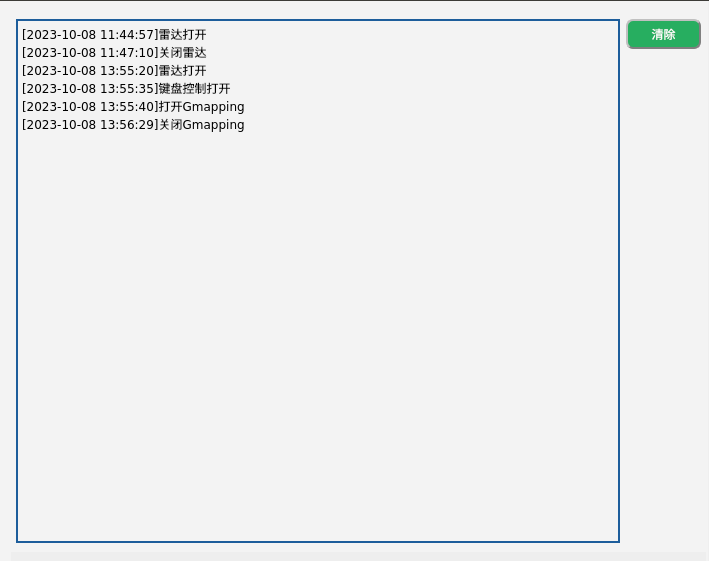

以上所有操作均会显示在日志区域。点击图示右侧“清除按钮”清空当前内容。

## 8. 状态监测

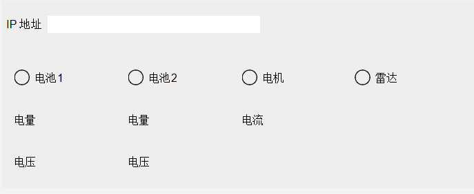

**1. IP地址显示:** 显示当前的IP地址  
**2. 电池信息:** 显示当前接入的电池信息  
（1） 接入后显示绿灯以及对应的电量和电压；未接入显示灰色，数值为0  

**3. 电机电流:** 显示电机电流信息  
（1） 电机在运动情况下有电流通过，此时电机会亮绿灯否有电流通过并显示当前电流数值；否则为灰色。  

**4. 雷达信息:** 显示雷达是否打开。  
（1） 雷达按钮打开时，绿灯亮起；雷达按钮关闭时，灯熄灭，转为灰色。
