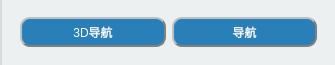

# MyAgv 上位机软件使用手册

## 语言切换

选择中英文，进行对应的语言切换。

## 雷达功能

1. 点击按钮，打开雷达。按钮变成红色，文字显示为“关”。
2. myAgv的雷达开始转动。
3. 桌面出现新的终端执行启动雷达的ros指令。

**限制**

1. 雷达打开：可使用基本控制、建图、导航、保存地图功能
2. 雷达关闭：
   1. 可使用LED灯光控制和测试功能
   2. 雷达关闭前需要确保基本控制、建图、导航功能已经关闭

## 基本控制功能

**主要通过键盘、手柄两种方式控制机器移动**

点击下拉框选择所需要的控制方式，并点击左侧按钮打开。

**前置条件：**
打开基本控制前需打开雷达，未打开则弹出提示框显示“雷达未打开”。

## 地图导航

**前置条件：**

   1. 打开雷达
   2. 打开键盘控制  

若未打开，则弹出提示框提示需要打开的项目。

### 建图

**建图方式分为Gmapping 和Cartographer 两种。**

点击下拉框选择所需建图方式，点击“打开建图”按钮开始建图。

   1. 桌面显示rviz界面
   2. 使用键盘控制小车，rviz空间会随着小车的移动将地图构建出来

**限制:**
开启建图后导航不可使用；若需使用导航功能请先关闭建图。

#### 保存建图

点击“保存建图”按钮，桌面出现新的终端显示保存的地图信息，默认保存在根目录。

### 导航

根据所需要的导航方式点击对应的按钮进行操作。

**限制**

1. 导航和3D导航两种方式只可选择其一。若需使用另一种，请关闭当前的使用方式。
2. 导航打开后不可打开建图，若需建图请关闭导航。

## LED 灯光设置

**前置条件：** 关闭雷达
通过圆盘选择灯光颜色，拖动滑动条改变灯光颜色的亮度。图示右侧则显示对应的HEX和RGB值。

## 测试功能

### 电机检测

**功能：** 检测电机是否可以正常运行  
**运行：**  

1. 下拉框选择电机，点击开始测试
2. 该过程建议将myAgv放在地面进行测试；过程中前进后退各4s，左平移和右平移各4s，左旋转和右旋转各8s
3. 以上步骤均执行后，检测完毕

### LED灯光检测

**功能：** 检测myAgv的LED灯光是否可以正常使用  
**运行：**  

1. 下拉框选择LED灯，点击开始测试
2. 依次切换赤橙黄绿青蓝紫颜色，若可正常观察到颜色切换；则LED灯正常使用
3. 每个颜色显示时长为1s，所有颜色正常显示后，检测完毕。

### 3D相机检测

待添加

### 2D相机检测

**功能：** 检测2D相机是否可以正常使用  
**运行：**  

1. 下拉框选择2D相机，点击开始测试
2. 弹出新窗口，显示摄像头捕捉到的画面；若可显示图像，摄像头正常运行。
3. 画面显示时长约5s，之后自动关闭窗口画面。检测完毕。

### 吸泵检测

**功能：** 检测吸泵是否可以正常使用  
**运行：**  

1. 下拉框选择吸泵，点击开始测试
2. 吸泵打开，运行4s后自动关闭；此时检测完毕

## 日志区域

以上所有操作均会显示在日志区域。点击图示右侧“清除按钮”清空当前内容。

## 状态监测

**1. IP地址显示:** 显示当前的IP地址  
**2. 电池信息:** 显示当前接入的电池信息  
（1） 接入后显示绿灯以及对应的电量和电压；未接入显示灰色，数值为0  

**3. 电机电流:** 显示是否有电流通过  
（1） 电机在运动情况下有电流通过，此时电机会亮绿灯；否则为灰色。  

**4. 雷达信息:** 显示雷达是否打开。  
（1） 雷达按钮打开时，绿灯亮起；雷达按钮关闭时，灯熄灭，转为灰色。
